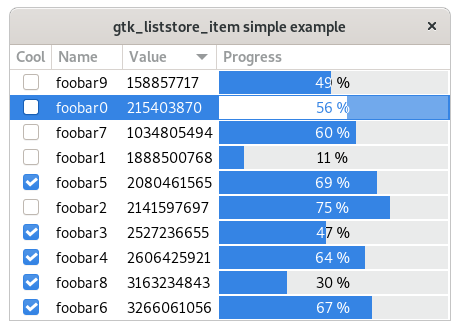

# gtk_liststore_item

[](https://github.com/MicroJoe/gtk_liststore_item/actions/workflows/ci.yml)
[](https://crates.io/crates/gtk_liststore_item)
[](https://docs.rs/gtk_liststore_item)
[](https://crates.io/crates/gtk_liststore_item)

Automatic `gtk::ListStore` struct derive for Rust.

## Usage

In order to use this crate, you have to add the following dependencies into
your project's `Cargo.toml` file:

```toml
[dependencies]
gtk_liststore_item = "1.0.2"
```

## Example

After the crate is installed, you can enjoy the `ListStoreItem` derive!

By defining the following structure:

```rust
#[derive(ListStoreItem)]
struct Item {
    name: String,
    value: u32,
    progress: u32,
    is_cool: bool,
}
```

You can directly create and add items to the `gtk::ListStore` model:

```rust
let mut list_store: gtk::ListStore = Item::new_liststore();

for i in 0..10 {
    let item = Item {
        name: format!("foobar{}", i),
        value: rand::random(),
        progress: rand::random::<u32>() % 100,
        is_cool: rand::random(),
    };
    item.insert_into_liststore(&mut list_store);
}
```

And directly see the result inside a `GtkTreeView` widget:



Without this crate, you would have to manually serialize each of the entries in
your struct with their type and position:

```rust
fn new_liststore() -> gtk::ListStore {
    gtk::ListStore::new(&[
        String::static_type(),
        u32::static_type(),
        u32::static_type(),
        bool::static_type(),
    ])
}

fn get_item(liststore: &gtk::ListStore, iter: &gtk::TreeIter) -> Item {
    Some(Item {
        name: list_store.value(&iter, 0).get::<String>().ok()?,
        value: list_store.value(&iter, 1).get::<u32>().ok()?,
        progress: list_store.value(&iter, 2).get::<u32>().ok()?,
        is_cool: list_store.value(&iter, 3).get::<bool>().ok()?,
    })
}

fn insert_item(item: &Item, list_store: &mut gtk::ListStore) -> gtk::TreeIter {
    list_store.insert_with_values(
        None,
        &[
            (0, &self.name),
            (1, &self.value),
            (2, &self.progress),
            (3, &self.is_cool)
        ]
    )
}
```

This can become pretty tedious, hence this crate to ease the process.

## License

Licensed under either of [Apache License, Version 2.0](LICENSE-APACHE) or [MIT
license](LICENSE-MIT) at your option.

Unless you explicitly state otherwise, any contribution intentionally submitted
for inclusion in this project by you, as defined in the Apache-2.0 license,
shall be dual licensed as above, without any additional terms or conditions.
